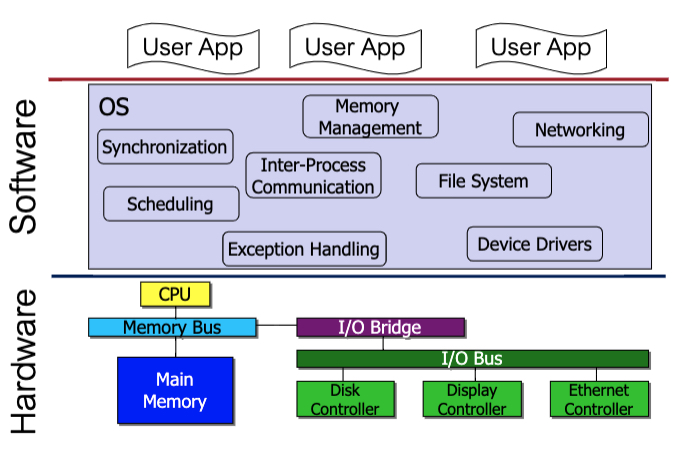

Link to Slides
https://q.utoronto.ca/courses/131103/modules

# What is OS?

* layer between user and hardware
  * abstraction of HW
  * protection, security, authentication
  * communication

# Goals of the OS
* two functions
  * primary: convenience for the user
  * secondary: efficiency of the computer system
* precedence depends on purpose of the computer system

# Role of OS
* virtual machine
  * Extends and simplifies interface to physical machine
  * Provides a library of functions accessible through an API
* resource allocator
  * allows the proper use of resources (hardware, software, data) in the operation of the computer system
  * provides an environment within which other programs can do useful work 
* control program
  * controls the execution of user programs to prevent errors and improper use of the computer 
  * especially concerned with the operation and control of I/O devices
  
# Storage Hierarchy
* rudimentary memory hierarchy
  * processor registers
  * main memory
  * auxiliary
* classified according to 
  * memory speed, cost, and volatility
* `caches` can be installed to hide performance differences when there is a large access-time gap between two levels

# Major OS Themes
* Virtualization
  * Present physical resource as a more general, powerful, or easy-to-use form of itself
  * Present illusion of multiple (or unlimited) resources where only one (or a few) really exist
  * Examples: CPU, Memory (demo) 
* Concurrency
  * parallel processes
  * Coordinate multiple activities to ensure correctness 
* Persistence
* eg. harddrive
  * Some data needs to survive crashes and power failures 
    * Need abstractions, mechanisms, policies for all

