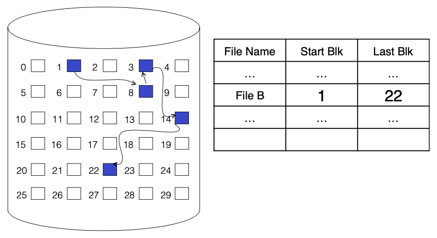
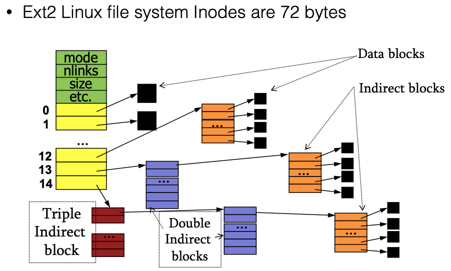

# From L01

## Major OS Themes
* Virtualization
* Concurrency
* Persistence

## Goals of the OS
1. convenience for the user
2. efficiency of the computer system

----
---

# Virtualize
How to virtualize persistent storage?

1. convenience
   * virtualization + abstraction
     * Files and directories abstract away the hard drive 
2. efficiency
   * File system controls when and how data is transferred to persistent storage

# Outline
* persistent storage of data
* files
* directories
* file operations
* how to specify which disk blocks belong to the file

# File Systems
* provide long term storage
* requirements:
  * large amounts of info
  * survive termination of process using it
  * multiple processes access info concurrently

## views of file system
* user view
  * onvenient logical org of info
* OS view
  * manage phys storage media
  * enforce access restrictions

# File Management Systems
* `files`
  * Implement an abstraction for secondary storage 
* `directories`
  * Organize files logically (directories)
* sharing of data
  * between processes, people, machine
* security
  * Protect data from unwanted access

# File Operations

* Creation
  - Find space in file system, add entry to `directory`
    - map file name to location and attributes • 
- Writing
- Reading
  - Dominant abstraction is “file as stream”
- Repositioning within a file
- Deleting a file
- Truncation and appending
  - May erase the contents (or part of the contents) of a file while keeping attributes

# File Access Methods
* General-purpose (simple)
  * sequential access
    * read bytes one at a time in order
  * direct access
    * random access given block/byte number
* database system (sophisticated)
  * record access (fixed or variable length)
  * indexed access

What access methods does Unix/Linux, windows provide?
* simple access
  * direct access
  * indexed access
* older systems are more complicated

# Directories
* Directories provide logical structures
  * user: means to organize
  * fs: convenient naming interface
    * separate logical file org from phys file placement
    * store info about files 
      * owner, permission, ....
* (most) multi level directories
  * naming hierarchies: /usr, /home,....
  * 
  
## Structure
* list of entries
  * names
  * `metadata`
    * not data, but information describes properties of data
* list is usually unordered (random)
  * sorted by program that reads it

### Examples

## DIRECTORY Implementation

### List
* cons:
  * maintaining consistency
  * deletion

### Hash Table
* create a list of file info structures
* Hash file name, to get a pointer to the file info structure
* con: takes up space

# Implementing File Systems
* Disk Layout
* File Metadata
* Directory data
  
## File system implementation

* blocks
* Master Block
* free map
  * determines which blocks are free

# Disk Layout strategies
## Contiguous allocation

   - blocks are contiguous (follow each other)
   - pros:
     - Fast, simplifies directory access
     - allows indexing
   - cons:
     - Inflexible, causes external fragmentation, requires compaction

## Linked, or chained, structure

   - blocks are scattered
   - Each block points to the next, directory points to the first
   - pros: 
     - sequential (streaming) access
   - cons:
     - all others
     - only points to next (no other connections)

##  Indexed structure (kind of like address translation)
   - An “index block” contains pointers to many other blocks
   - pros:
     - Handles random access better, still good for sequential 
     - May require multiple, linked index blocks

## Unix Inodes

* `ext2` file system
  * larger file systems, not usually used everyday
* Unix `inodes` implement an indexed structure for files 
* All file metadata is stored in an `inode`
  - Unix directory entries map file names to inodes
* Each inode contains `15` block pointers 
  * `0 - 11` - 12 x direct block pointers
    - Disk addresses of first 12 data blocks in file
  - `12` - a **single indirect** block pointer
    - Address of block containing addresses of data blocks - 
  - `13` - a **double indirect** block pointer
    - Address of block containing addresses of single indirect blocks
  - `14` - a **triple indirect** block pointer
